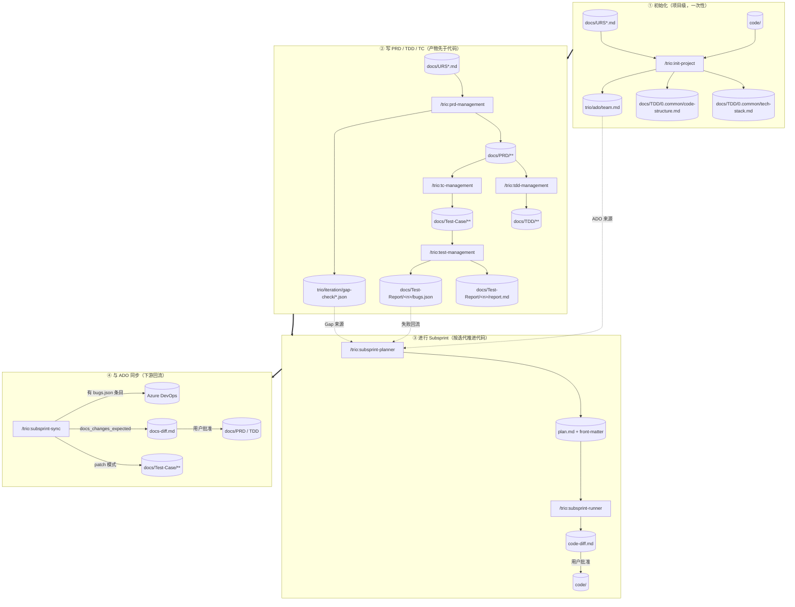
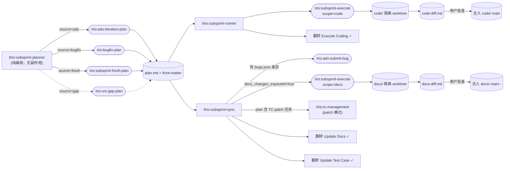
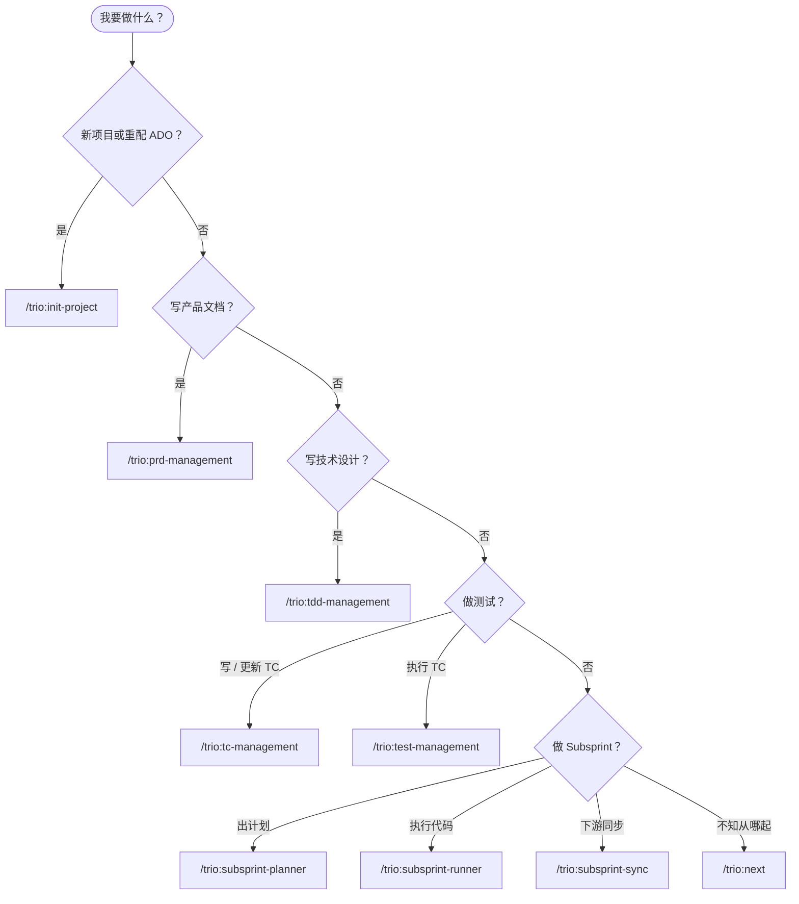

<div align="center">

# 🎭 Trio 工作原理（开发者视角）

**9 个 Skill 编排流程，13 个 Agent 干脏活，中间靠几份契约文件串起来。**

</div>

---

## 📖 目录

- [🎭 Trio 工作原理（开发者视角）](#-trio-工作原理开发者视角)
  - [📖 目录](#-目录)
  - [1. Trio 解决什么](#1-trio-解决什么)
    - [1.1 当前痛点](#11-当前痛点)
    - [1.2 应对思路](#12-应对思路)
  - [2. 两层架构：Skill vs Agent](#2-两层架构skill-vs-agent)
  - [3. 三仓库布局](#3-三仓库布局)
  - [4. 跨阶段契约（先看这个）](#4-跨阶段契约先看这个)
    - [4.1 `docs/TDD/0.common/tech-stack.md`](#41-docstdd0commontech-stackmd)
    - [4.2 `docs/TDD/0.common/code-structure.md`](#42-docstdd0commoncode-structuremd)
    - [4.3 Bug schema v1.1](#43-bug-schema-v11)
    - [4.4 Plan Front-Matter Contract](#44-plan-front-matter-contract)
    - [4.5 Plan Checklist Contract](#45-plan-checklist-contract)
    - [4.6 命名规则](#46-命名规则)
  - [5. 端到端流水线](#5-端到端流水线)
  - [6. Subsprint 三段式](#6-subsprint-三段式)
  - [7. 跟踪一次调用](#7-跟踪一次调用)
  - [8. Skill 索引（9 个）](#8-skill-索引9-个)
  - [9. Agent 索引（13 个）](#9-agent-索引13-个)
  - [10. 扩展 Trio](#10-扩展-trio)
  - [11. 决策树](#11-决策树)

---

## 1. Trio 解决什么

### 1.1 当前痛点

在没有 Trio 之前，AI 辅助开发的项目里反复出现下面几类问题：

1. **文档和代码不统一**：PRD 写 A、代码做 B；TDD 里的 API 设计跟实际路由对不上；改了代码忘改文档。手动维护这种映射没人愿意做，时间一长文档变废纸。
2. **本地文件和团队文件不统一**：团队在 Azure DevOps 上跟踪 User Story，个人在本地写计划/改代码，两边永远漂移；本地测出 Bug 没人提到 ADO，ADO 上指派的任务本地没有对应执行计划。
3. **AI 协作没有共享上下文**：每开一个新会话/新 Agent 就要重新讲一遍"项目用什么技术栈、模块怎么分、代码在哪"。要么讲不全 AI 乱猜，要么每次都得粘贴一大段。
4. **各阶段产物格式割裂**：需求、设计、用例、测试报告、Bug 列表各写各的，下游想机器读上游产物只能靠正则猜结构。
5. **测试结果落不到代码修复**：测试报告写"用户登录失败"，但没有指向具体代码路径、没有标准化的修复任务列表，Bug 修复全靠人脑串联报告→代码→PR。
6. **命名/编号混乱**：PRD 里叫"模块 1"、TDD 里叫"认证模块"、TC 里又编 `auth-001`，三处对不上号，追溯失败。
7. **代码改动盲目合并到 main**：AI 一通改完直接落库，没人审 diff；想回滚要翻 git log 猜哪几个 commit 是这一轮的。
8. **多源迭代规划无统一入口**：今天根据 ADO User Story 干、明天根据测试 Bug 干、后天根据 URS Gap 干，每种来源走不同的临时流程，新人无从下手。
9. **进度不可视**：一轮迭代改到一半，"代码合了没？文档同步了没？测试用例补了没？"全靠人脑记。
10. **跑挂了不敢重试**：传统工作流把状态藏在会话/内存里，中断就废，重启等于从头再来。

### 1.2 应对思路

Trio 是装在 Claude Code 里的项目工作流：把"写需求 → 写设计 → 写用例 → 跑测试 → 根据测试结果/ADO/Gap 规划下一轮迭代"这条链子拆成可独立调用的步骤，并强制每一步的输入输出走标准化路径与格式。核心目标：

- **产物可追溯**：每份 PRD / TDD / Test-Case / Bug 都有确定的文件位置与编号规则。
- **执行可重入**：任意一步挂掉，重新调一次 Skill 即可继续——Skill 只依赖磁盘上的文件，不依赖会话内存。
- **范围可隔离**：涉及代码变更的操作都跑在 `code/` worktree 里，靠 `code-diff.md` 让用户显式批准合入。

Skill 与 Agent 的加载来源：

- `/Users/superbig/my-todo/Vivaldi/.claude/skills/trio:*/SKILL.md` —— 9 个业务 Skill
- `/Users/superbig/my-todo/Vivaldi/.claude/agents/trio:*.md` —— 13 个 Agent
- 已安装插件 `trio` v1.5.0 —— 只提供两个与工作流无关的命令（`/trio:view-document` 打开本地 Wiki，`/trio:stop` 停掉 Wiki 服务）

---

## 2. 两层架构：Skill vs Agent

```text
用户
 │
 │ /trio:<skill>
 ▼
┌────────────────────────┐
│ Skill（流程编排层）     │  读磁盘 → 分支决策 → 问用户 → 调度 Agent
│ SKILL.md，9 个          │  ❌ 不写业务产物
└───────────┬────────────┘
            │ Agent tool
            ▼
┌────────────────────────┐
│ Agent（产物生成层）     │  接收绝对路径 + 选项 → 读相关文件 → 写固定格式产物
│ agents/*.md，13 个       │  ❌ 对会话"失忆"，每次独立调用
└───────────┬────────────┘
            │ Write/Edit/Bash
            ▼
   docs/ | code/ | trio/
```

**为什么这样分层**：

1. **流程复用 vs 操作复用**：流程（"先问是 ADO 还是 Bug 修复"）变化快，操作（"按 Bug schema 生成一份 subsprint-plan"）变化慢。分层让前者迭代不污染后者。
2. **单任务上下文**：Agent 每次都从零加载上下文，调度方必须把它需要的绝对路径全部显式写进 prompt。这强制"产物输入"写清楚，避免 Skill 之间隐式传状态。
3. **人工可替代**：任何 Agent 都可以在没有 Skill 的情况下，由用户直接手写 Agent 调用 prompt 再跑一遍——便于修复、补写、重放。

**Subsprint 例外：三段式分离**。代码执行与文档/ADO 同步被拆成 `planner`/`runner`/`sync` 三个独立 Skill，用户可以只跑 `planner` 出计划就停；也可以 `runner` 后决定不做 docs 同步。三段彼此独立，互不阻塞。

---

## 3. 三仓库布局

根目录下的三个顶层文件夹，边界严格：

| 目录 | Git | 谁写 | 谁读 |
|------|-----|------|------|
| `docs/` | ✅ 独立 `docs/.git` | PRD / TDD / TC Agents；`subsprint-execute` scope=docs | 所有下游 Skill/Agent |
| `code/` | ✅ 独立 `code/.git` | `subsprint-execute` scope=code | `trio:tdd-code-structure`、`trio:test-testcase-execution-agent` |
| `trio/` | ❌ **不追踪** | 所有 Skill 的过程产物 | 流程本身 |

`trio/` 不入 git，是因为它装了：ADO 团队快照（含同事邮箱）、迭代计划、Gap Check 报告、subsprint 工件等"过程状态"——产品文档历史不应被这些噪音污染。

**`trio/` 固定子目录**：

```
trio/
├── process.md                      # 本文档
├── ado/team.md                     # ADO 团队成员快照
├── iteration/gap-check/*.json      # URS↔PRD Gap 报告
├── subsprint/<n>-YYYY-MM-DD-HH-MM/ # 当前 subsprint 工件
│   ├── <n>-subsprint-plan.md       #   计划（唯一入口）
│   ├── code-diff.md                #   runner 产出
│   ├── docs-diff.md                #   sync(docs) 产出（可选）
│   └── notes/                      #   fresh 计划的素材
```

---

## 4. 跨阶段契约（先看这个）

要读懂 Trio，先认这几份契约文件；它们是各 Skill/Agent 之间的"API"。

### 4.1 `docs/TDD/0.common/tech-stack.md`

- **生产者**：`/trio:init-project`
- **消费者**：几乎所有下游 Skill
- **作用**：把"这个项目用 React 还是 Vue、后端用什么 DB、测试框架是什么"等回答写下来，避免每个 Agent 自己去猜。
- **禁止重命名**。

### 4.2 `docs/TDD/0.common/code-structure.md`

- **生产者**：`trio:tdd-code-structure`（由 `/trio:init-project` 或 `/trio:tdd-management` 调度）
- **消费者**：`/trio:tc-management`、`/trio:test-management`、`trio:bugfix-plan`、`trio:ado-iteration-plan`、`trio:subsprint-fresh-plan`、`trio:subsprint-execute`
- **作用**：把 PRD 模块 ↔ 代码路径（前端 route/page/store + 后端 route/handler/service/table）映射表写下来。所有需要"去改某模块代码"的 Agent，都查这张表确认动哪些文件。
- **禁止重命名**。

### 4.3 Bug schema v1.1

权威定义位于 `/trio:test-management` 的 `SKILL.md`。12 个字段、固定顺序（v1.1 在 `summary` 之后新增 `subject` —— 失败时刻生成的 < 30 词可读单句，下游用作 ADO Bug 标题）。

- **生产者**：`/trio:test-management` + `trio:test-testcase-execution-agent`
- **消费者**：`trio:bugfix-plan`（读它生成修复任务）、`trio:ado-submit-bug`（读它提 ADO Bug）
- 字段变更必须回到 SKILL.md 更新，而且消费方 Agent 同时改。

### 4.4 Plan Front-Matter Contract

每份 `trio/subsprint/<n>-*/<n>-subsprint-plan.md` 都必须以 YAML front-matter 开头：

```yaml
---
source: ado | bugfix | fresh | gap   # 来源
subsprint_id: <n>
subsprint_folder: <n>-YYYY-MM-DD-HH-MM
docs_changes_expected: true | false   # 决定 sync 是否起 docs/ worktree
---
```

`trio:subsprint-execute` 读 `docs_changes_expected` 决定是否起 docs worktree；`/trio:subsprint-sync` 读 `source` 决定三段同步动作（ADO / docs / TC）哪些可用。

### 4.5 Plan Checklist Contract

plan 文件尾部必含：

```markdown
## Execution Checklist
- [ ] Execute Coding
- [ ] Update Docs
- [ ] Update Test Case
```

- `Execute Coding` 由 `/trio:subsprint-runner` 翻转
- `Update Docs` 由 `/trio:subsprint-sync`（docs worktree 合入后）翻转
- `Update Test Case` 由 `/trio:subsprint-sync`（`trio:tc-write` patch 模式跑完后）翻转

三个勾的状态即 subsprint 推进状态。`/trio:next` 会读它来决定推荐什么。

### 4.6 命名规则

| 对象 | 模板 | 约束 |
|------|------|------|
| 模块目录（PRD / TDD / TC 三处） | `<编号>. <中文名>` | 编号三处保持一致 |
| 报告 / Subsprint 子目录 | `<n>-YYYY-MM-DD-HH-MM` | `<n>` 为既有最大值+1，subsprint 跨 `trio/subsprint/` / `trio/iteration/` / `trio/bugfix/` 三目录统一编号 |
| 测试用例 ID | `TC-<模块号>.<子模块号>-NNN` | 自动化脚本块标题必须以该 ID 原样开头 |
| Subsprint plan 文件名 | `<n>-subsprint-plan.md` | 与 subsprint 子目录编号一致 |

---

## 5. 端到端流水线

整条流水线按照**四个阶段**顺序推进。前两个阶段是"装配项目"——只做一次（或重大变更时重做）；后两个阶段是"按迭代推进"——每个 subsprint 都重复一次。



**阶段 ①：初始化（项目级，一次性）**
新项目第一件事跑 `/trio:init-project`。它读 `docs/URS*.md` + `code/`（如果有）产出三份基础设施：`tech-stack.md`（技术栈手册）、`code-structure.md`（PRD 模块 ↔ 代码路径映射）、`trio/ado/team.md`（ADO 团队成员快照）。重大重构、技术栈替换或团队成员变更时再跑一次刷新。

**阶段 ②：写 PRD / TDD / TC（产物先于代码）**
按"需求 → 设计 → 用例 → 跑测试"线性推进：
- `/trio:prd-management` 把 URS 翻成 `docs/PRD/**`，必要时产 Gap Check JSON 标注"URS 里有但 PRD 里没有"。
- `/trio:tdd-management` 读 PRD + `code-structure.md` 写 `docs/TDD/**`。
- `/trio:tc-management` 读 PRD 写 `docs/Test-Case/**`。
- `/trio:test-management` 跑 TC 出 `report.md` + `bugs.json`（符合 Bug schema v1.1）。

**阶段 ③：进行 Subsprint（按迭代推进代码）**
所有"动代码"的需求都收口到这里：
- `/trio:subsprint-planner` 是唯一入口，吸纳三种来源——上一轮测试的 `bugs.json`、ADO User Story、URS Gap JSON——产出统一格式的 plan.md（front-matter 标 `source` + `docs_changes_expected`）。
- `/trio:subsprint-runner` 在 `code/` 隔离 worktree 里执行 plan，产 `code-diff.md`，由用户批准后合入。

**阶段 ④：与 ADO 同步（下游回流）**
代码合入后跑 `/trio:subsprint-sync`，按需触发三件事：
- 把本轮 `bugs.json` 提到 ADO 当 Bug 工单。
- 若 plan 标了 `docs_changes_expected: true`，起 `docs/` 隔离 worktree 同步 PRD/TDD，产 `docs-diff.md` 等用户批准。
- 若 plan 含 TC 修改任务，调 `/trio:tc-management` 的 patch 模式更新测试用例。

阶段 ④ 跑完，本轮 plan 的三勾 checklist 全部翻到 ✓，回到阶段 ③ 起下一个 subsprint。

---

## 6. Subsprint 三段式

代码/文档/测试用例三种下游副作用被刻意拆开，各走各的 worktree、各自产 diff、各自等用户批准：



**关键不变式**：

- Runner **只**碰 `code/`；Sync 的 docs 子动作**只**碰 `docs/`。Worktree 隔离意味着失败可丢弃，不污染主分支。
- 每次合入前都会产 `*-diff.md`，由用户人工确认。Skill 本身不做"自动合并"。
- 三个勾（`Execute Coding` / `Update Docs` / `Update Test Case`）是 subsprint 的官方状态机；`/trio:next` 靠它知道"这个 subsprint 还差哪步"。

---

## 7. 跟踪一次调用

把上面拼起来，走一个典型例子。用户执行：

```
/trio:test-management
```

1. `/trio:test-management` 这个 Skill 被加载（`.claude/skills/trio:test-management/SKILL.md`）。
2. Skill 做三件事：
   - 读 `docs/Test-Case/` 算出子模块列表、让用户选。
   - 读 `docs/Test-Report/` 找最大编号 `<n>`，新建 `<n>-YYYY-MM-DD-HH-MM/` 目录。
   - 校验覆盖率 ≥ 90%（Bug schema v1.1 的"产生者"职责）。
3. 每个子模块调度一次 `trio:test-testcase-execution-agent`（Agent 工具，`.claude/agents/trio:test-testcase-execution-agent.md`），传入该子模块的 TC 路径、报告目录、浏览器工具权限。Agent 跑完写 `partials/<sub#>.json`。
4. 全部跑完，Skill 把 partials 汇总成 `report.md` + `bugs.json`（符合 Bug schema v1.1）。
5. 若有 failure，Skill **不**自动链到 bugfix —— 它只告诉用户"下一步可跑 `/trio:subsprint-planner`"。

随后用户跑 `/trio:subsprint-planner` 选 "[2] 最近失败的测试报告"：

1. Planner 读 `docs/Test-Report/<n>/bugs.json`。
2. 调度 `trio:bugfix-plan` 生成 `trio/subsprint/<n>-*/<n>-subsprint-plan.md`（front-matter `source: bugfix`）。
3. Planner 告诉用户："下一步 `/trio:subsprint-runner`"。

`/trio:subsprint-runner`：

1. 解析 plan 路径 → 读 front-matter。
2. `git worktree add` 在 `code/` 起一个隔离分支。
3. 调度 `trio:subsprint-execute`（scope=code），Agent 在 worktree 里逐任务改代码、commit。
4. Agent 返回，写 `code-diff.md`。
5. Runner 展示 diff，用户批准后 `git merge` 回 `code/` main。
6. 翻转 plan checklist 的 `Execute Coding`。
7. 提示用户跑 `/trio:subsprint-sync`。

`/trio:subsprint-sync`：

1. 读 plan front-matter + 现有 `bugs.json` + plan 内的 TC 修改任务。
2. 出菜单（多选）：ADO Bug 提交 / docs 合入 / TC 更新。
3. 选中的动作按序执行（分别调 `trio:ado-submit-bug` / `trio:subsprint-execute` scope=docs / `/trio:tc-management` patch）。
4. 每个动作完成后翻转对应 checklist 项。

---

## 8. Skill 索引（9 个）

| Skill | 什么时候调 | 调度的 Agent | 关键副作用 |
|-------|-----------|--------------|----------|
| `/trio:init-project` | 新项目或重配 ADO | `trio:tdd-code-structure`（条件） | 建 `docs/` + `trio/` 骨架、`tech-stack.md`、`ado/team.md` |
| `/trio:prd-management` | 写 / 更新 / 审 PRD | `trio:prd-overview`、`trio:prd-by-module`、`trio:prd-check-urs-gap`、`trio:prd-add-screenshot` | `docs/PRD/**`、Gap JSON |
| `/trio:tdd-management` | 写 / 更新 TDD | `trio:tdd-write-all`、`trio:tdd-code-structure` | `docs/TDD/**`、`code-structure.md` |
| `/trio:tc-management` | 写 / 更新 TC；patch 模式由 sync 间接调 | `trio:tc-write` | `docs/Test-Case/**`、`test-script-mapping.md` |
| `/trio:test-management` | 跑测试 | `trio:test-testcase-execution-agent` | `docs/Test-Report/<n>/report.md` + `bugs.json` |
| `/trio:subsprint-planner` | 出 subsprint plan | `trio:ado-iteration-plan`、`trio:bugfix-plan`、`trio:subsprint-fresh-plan`、（`trio:urs-gap-plan`） | `trio/subsprint/<n>-*/<n>-subsprint-plan.md` |
| `/trio:subsprint-runner` | 执行代码半 | `trio:subsprint-execute` (scope=code) | `code/` commits + `code-diff.md` |
| `/trio:subsprint-sync` | 执行下游同步 | `trio:ado-submit-bug`、`trio:subsprint-execute` (scope=docs)、（间接）`trio:tc-write` | ADO Bug、`docs/` commits + `docs-diff.md`、TC patch |
| `/trio:next` | 不知道下一步 | —（只读推荐） | 无 |

---

## 9. Agent 索引（13 个）

| Agent | 产物路径 | 调度者 |
|-------|--------|--------|
| `trio:prd-overview` | `docs/PRD/PRD-Overview.md` + 模块文件夹骨架 | `/trio:prd-management` |
| `trio:prd-by-module` | `docs/PRD/<module>/0.*-overview.md` + `<n>. 子模块.md` | `/trio:prd-management` |
| `trio:prd-check-urs-gap` | `trio/iteration/gap-check/Gap Check <n> YYYY-MM-DD-HH-MM.json` | `/trio:prd-management` |
| `trio:prd-add-screenshot` | PRD 内嵌图 + `docs/PRD/<module>/screenshots/*.png` | `/trio:prd-management` |
| `trio:tdd-write-all` | `docs/TDD/<module>/0.database-design.md` + `1.api-design.md` + 子模块 TDD | `/trio:tdd-management` |
| `trio:tdd-code-structure` | `docs/TDD/0.common/code-structure.md` | `/trio:tdd-management`、`/trio:init-project` |
| `trio:tc-write` | `docs/Test-Case/<module>/*.md` + 脚本 + `test-script-mapping.md`（audit / patch 双模式） | `/trio:tc-management` |
| `trio:test-testcase-execution-agent` | `docs/Test-Report/<n>/partials/<sub#>.json` + `screenshots/*.png` | `/trio:test-management` |
| `trio:ado-iteration-plan` | `<n>-subsprint-plan.md`（front-matter `source: ado`） | `/trio:subsprint-planner` |
| `trio:bugfix-plan` | `<n>-subsprint-plan.md`（front-matter `source: bugfix`） | `/trio:subsprint-planner` |
| `trio:subsprint-fresh-plan` | `<n>-subsprint-plan.md`（front-matter `source: fresh`）+ `notes/` | `/trio:subsprint-planner` |
| `trio:subsprint-execute` | worktree commits + `code-diff.md` / `docs-diff.md` + 可选合入 | `/trio:subsprint-runner`、`/trio:subsprint-sync` |
| `trio:ado-submit-bug` | 更新 `bugs.json`（注入 `adoBugId` / `adoUrl`） | `/trio:subsprint-sync` |

> 另有 `trio:urs-gap-plan` 计划中，接 `source: gap` 分支。

---

## 10. 扩展 Trio

想往里面加功能时的常见套路：

**新 Skill**：在 `.claude/skills/trio:<name>/SKILL.md` 写一份 frontmatter（`name` / `description`）+ 正文。`description` 会被 Claude Code 读到系统提示里，决定什么时候自动触发——写明"调用条件 + 不调用条件"比写"做什么"更重要。Skill 里不要直接写产物，所有写操作都走 Agent。

**新 Agent**：在 `.claude/agents/trio:<name>.md` 写 frontmatter + prompt 模板。要特别注意列出 Agent 允许用的 Tools（默认继承，但通常要收窄到只读 + `Write/Edit`）。因为 Agent 对会话失忆，所有它需要的绝对路径、配置选项、上游契约文件都要在调度时的 prompt 里**显式写出**。

**要改契约文件（tech-stack / code-structure / Bug schema / Plan front-matter）**：先在生产端 Skill 的 SKILL.md 更新定义，再同步改所有消费端 Agent。契约是跨阶段的，不能单边改。

**新 Subsprint 来源**：在 `/trio:subsprint-planner` 里加一个分支，写一个新的 plan-生成 Agent（参照 `trio:bugfix-plan`），让它产出带正确 front-matter `source` 的 plan 文件。runner / sync 不需要改，因为它们只看 front-matter。

---

## 11. 决策树



---

<div align="center">

**📂 文件位置**：`trio/process.md`（未被 git 追踪）
**🔄 最近更新**：2026-04-25（在第 1 节前置"当前痛点"清单，逐条映射到 Trio 的对应机制）

*本文档源自 `.claude/skills/trio:*` 与 `.claude/agents/trio:*` —— 上游变更时请同步更新本文。*

</div>
