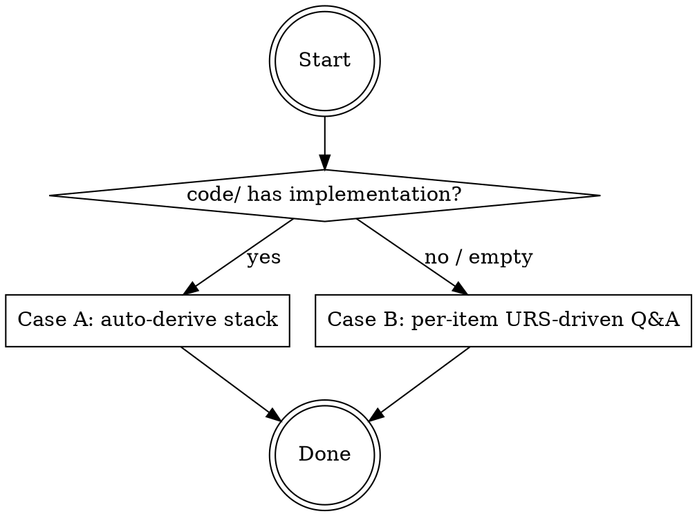

You scaffold a new Trio-managed project. The skill has a **single phase** — project bootstrap.

# Phase

| Phase | Purpose | Outputs |
|-------|---------|---------|
| 1. Project bootstrap | Folder skeleton + canonical `docs/TDD/0.common/tech-stack.md` (and `code-structure.md` when `code/` already has an implementation). All downstream skills and agents depend on these. | `docs/`, `trio/` skeleton; `tech-stack.md`; optional `code-structure.md`. |

# Canonical output files

Two fixed-name files under `docs/TDD/0.common/` are cross-command contracts — NEVER rename them:

| File | Producer | Purpose |
|------|----------|---------|
| `tech-stack.md` | this skill (Phase 1) | Authoritative description of the project's chosen stack |
| `code-structure.md` | `trio:tdd-code-structure` agent (dispatched in Phase 1, Case A) | Code-to-feature mapping (frontend routes, backend endpoints, modules → code paths) |

# Step 0: Detect existing state

Inspect the current state. If `docs/TDD/0.common/tech-stack.md` already exists, **re-running Phase 1 always overwrites `tech-stack.md`** (and may re-dispatch `trio:tdd-code-structure`). Confirm with the user before doing so on an existing stack file.

# Phase 1 — Project bootstrap

## Folder skeleton to ensure

- `docs/PRD/`
- `docs/TDD/`, `docs/TDD/0.common/`
- `docs/Test-Case/`
- `docs/Test-Report/`
- `trio/` (top-level, untracked) — with `trio/iteration/`, `trio/iteration/gap-check/`, `trio/bugfix/`

The `trio/` folder is intentionally outside both git repos (`docs/.git`, `code/.git`) and is untracked — it holds workflow artifacts that don't belong in product docs.

## Root `CLAUDE.md` — folder rule contract

Every Trio-managed project needs a root-level `CLAUDE.md` that pins the three-bucket layout (`docs/` / `code/` / `trio/`) so any future Claude Code session in this project picks it up automatically. Always ensure the project root contains a `# Rule for Folder` section with EXACTLY this content (verbatim — these rules are referenced by other Trio skills):

```markdown
# Rule for Folder

- 2 gits under this folder (`docs/.git`, `code/.git`)
- Top-level layout:
  - `docs/` — product documents (PRD, TDD, Test-Case, Test-Report, URS). Tracked in `docs/.git`.
  - `code/` — implementation + configuration. Tracked in `code/.git`.
  - `trio/` — workflow artifacts (process reference, iteration/bugfix plans, gap checks). **Untracked** on purpose — contents often include in-flight plans that don't belong in product doc history.
- Always put documents under `docs/`, code/configuration under `code/`, workflow artifacts under `trio/`.
- Ask for confirmation if you're not sure which bucket a new file belongs in.
```

Behavior:

- **No `CLAUDE.md` exists** → create it with the block above as the only content.
- **`CLAUDE.md` exists, no `# Rule for Folder` section** → append the block (preserve existing content).
- **`CLAUDE.md` exists with a `# Rule for Folder` section** → replace just that section's body so it matches the canonical text verbatim; leave every other section untouched.

NEVER blindly overwrite an existing `CLAUDE.md` — other project content may already live there.

## P1.0: Detect existing code

Before any clarification, check whether `code/` already contains an implementation.

**Signals**: any of `code/package.json`, `code/pyproject.toml`, `code/go.mod`, `code/Cargo.toml`, `code/pom.xml`, `code/build.gradle`, `code/Gemfile`, or a non-trivial subfolder under `code/`.



### Case A — `code/` already has an implementation

Existing code is the source of truth. **Skip URS clarification and the user-facing tech-stack Q&A** — derive everything from the codebase instead.

1. **Create the skeleton** (see above).
2. **Auto-derive `docs/TDD/0.common/tech-stack.md`**:
   - Read whichever dependency manifest(s) exist under `code/`.
   - Identify frameworks, ORM / data layer, build tools, test runner, CLI/scheduler libraries from those dependencies.
   - Cross-check with directory layout (entry files, source folders).
   - Write a concise `tech-stack.md` using the six categories (Database, Frontend Stack, Backend Stack, SCM, Performance, Other) from Case B. Fill only what can be inferred; mark the rest `(not detected — confirm with user later)`.
   - **No user interaction in this step.**
3. **Dispatch `trio:tdd-code-structure` agent** to produce `docs/TDD/0.common/code-structure.md`. Pass: project root absolute path; explicit note that `tech-stack.md` now exists.
4. **Report to the user**:
   - Folders created vs already existed
   - `CLAUDE.md` action taken (created / appended / section refreshed / already canonical)
   - Written files: `docs/TDD/0.common/tech-stack.md`, `docs/TDD/0.common/code-structure.md`
   - Anything left as `(not detected)` so the user can fill the gaps if they care
   - Route count, endpoint count, coverage gaps from `code-structure.md`

### Case B — `code/` empty or missing

Proceed with the full clarification workflow to produce `docs/TDD/0.common/tech-stack.md`. `code-structure.md` cannot be produced yet (no code) — `trio:tdd-management` will generate it later via the `trio:tdd-code-structure` agent once code exists.

#### Categories to clarify (six buckets)

1. **Database** — type (MySQL / PostgreSQL / SQLite / MongoDB), version, ORM/data layer (Prisma / TypeORM / Sequelize / Knex), deployment (local / Docker / managed), backup + migration strategy.
2. **Frontend Stack** — framework (Vue 3 / React / Angular / Svelte) + version, build tool (Vite / Webpack / Next.js / Nuxt), UI library (Ant Design Vue / Element Plus / MUI / Tailwind), state management (Pinia / Vuex / Redux / Zustand), routing, i18n.
3. **Backend Stack** — language + runtime + version, framework (Express / NestJS / FastAPI / Spring), API style (REST / GraphQL / gRPC), auth, CLI tooling, scheduled job library.
4. **Source Code Management** — git hosting, branching strategy, review process, commit conventions, CI/CD platform.
5. **Performance** — concurrent users, response-time target, throughput, data volume, SLA, scalability.
6. **Other** — file storage (local / S3 / MinIO), logging + monitoring, deployment environments, security/compliance, localization.

#### Workflow

1. **Understand URS first** — read `docs/URS*.md` in full, scan any existing project configs (`package.json`, `pyproject.toml`) for already-fixed choices. Build a map: items already answered by URS / existing files vs. items still open.
2. **Summarize URS coverage to the user** — table of covered items (with source) + list of items still needing clarification.
3. **Ask clarification questions ONE AT A TIME**:
   - Never dump all questions at once.
   - Ask one; wait; confirm; move on.
   - Provide 2-3 reasonable options + a recommended default per question.
   - After each answer, briefly acknowledge + record.
   - Only once all items are resolved, write the `tech-stack.md`.
4. **If URS already specifies an item, use URS and do NOT ask again** — annotate "Source: URS" in the file.

# Agents this skill dispatches

| When | Agent | Pass |
|------|-------|------|
| Phase 1, Case A, after `tech-stack.md` is written | `trio:tdd-code-structure` | Project root absolute path. |

# Rules

- Always ensure the project root has a `CLAUDE.md` containing the canonical `# Rule for Folder` section verbatim. Create / append / refresh-in-place — never blindly overwrite.
- NEVER rename `tech-stack.md` or `code-structure.md`.
- Phase 1 Case A: no user-facing Q&A for the stack. Derive everything from `code/`.
- Phase 1 Case B: strictly one question at a time.
- If URS covers an item, don't ask the user again.
- Create `trio/` at the top level even though it's untracked — downstream skills expect the path.
