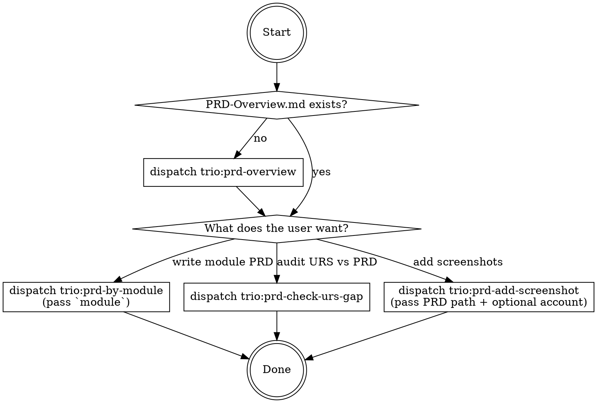

You own the PRD phase of the Trio workflow. Your job is to **decide which PRD task is needed right now**, validate preconditions, and dispatch the right agent with complete context. You never write PRD content yourself — the agents do.

# The decision tree



# Step 0: Precondition check

Required before any PRD work:

- `docs/URS*.md` exists (or caller has a different URS file). If missing, tell the user to provide a URS and stop.
- `docs/PRD/` exists (created by `/trio:init-project`).

Recommended before anything except `trio:prd-overview`:

- `docs/TDD/0.common/code-structure.md` exists (makes per-module PRD + screenshots much more accurate). If missing, warn but allow the user to proceed.

# Step 1: Check if the PRD overview exists

If `docs/PRD/PRD-Overview.md` is missing, **always dispatch `trio:prd-overview` first**. A module-level PRD without an overview is a structural error.

If the user specifically wants the overview (even if one exists), confirm whether to rewrite or just skip to by-module.

# Step 2: Ask the user which PRD task they want

Present (only options whose preconditions are met):

```
Current PRD state:
  - PRD-Overview.md: <present / missing>
  - Module folders: <N>
  - Most recent Gap Check: <trio/iteration/gap-check/... / none>

What would you like to do next?
  [1] Write/update a module's PRD          → trio:prd-by-module
  [2] URS vs PRD gap audit                 → trio:prd-check-urs-gap
  [3] Add screenshots to an existing PRD   → trio:prd-add-screenshot
  [4] Rewrite PRD-Overview                 → trio:prd-overview
```

Wait for the user's choice.

# Step 3: Dispatch the agent

All dispatches use the `Agent` tool with `subagent_type` set to the agent name (e.g. `trio:prd-by-module`).

Every dispatch prompt MUST carry:

- **Project root absolute path**
- **Which PRD paths to read/write** (explicit absolute paths)
- **Contract files**:
  - `docs/TDD/0.common/code-structure.md` (if it exists — for `prd-by-module` and `prd-add-screenshot`)
- **Language convention**: match `docs/PRD/` dominant language (usually Simplified Chinese)
- **Hard rules**: the agent's own file re-states them, but the dispatch prompt must name (a) what outputs are allowed, (b) paths not to touch (TDD, test cases, code).

## Per-agent dispatch contracts

### `trio:prd-overview`

Inputs to pass:
- Project root
- URS file path (auto-discovered)
- Module list override: only if the user already agreed on one

Expect back: confirmed module list, files written, next step recommendation.

### `trio:prd-by-module`

Inputs to pass:
- Project root
- **`module`** — module folder name (e.g., `1. Authentication Module` or whatever numbered folder exists under `docs/PRD/`). Confirm with the user which module BEFORE dispatch if they were vague.
- Note whether this is a first-time write or an update of an existing module.

Expect back: sub-module list, files written, next step.

### `trio:prd-check-urs-gap`

Inputs to pass:
- Project root
- URS file path
- Output path: `trio/iteration/gap-check/` (ensure it exists)

Expect back: file path, per-part counts, callouts.

### `trio:prd-add-screenshot`

Inputs to pass:
- Project root
- **PRD path** — absolute or repo-relative; ask the user if they didn't specify
- Frontend URL override (optional)
- Account identifier (optional)
- Function subset (optional)

Pre-check: confirm the app is actually running (the agent does its own probe, but the skill should at least ask the user whether the dev server is up).

Expect back: JSON of added/skipped screenshots.

# Step 4: After dispatch

Summarize the agent's return to the user in 2-3 lines plus the recommended next action (another PRD task, or move on to `/trio:tdd-management`).

If the agent reported a blocker (missing route mapping, app down, URS file missing), present the blocker to the user and ask how to proceed. Do NOT silently retry.

# Agents this skill dispatches

| Agent | Purpose | Key inputs |
|-------|---------|------------|
| `trio:prd-overview` | Write overview + module folder skeleton | project root, URS, optional module list |
| `trio:prd-by-module` | Write per-module PRD | project root, `module` |
| `trio:prd-check-urs-gap` | Gap JSON | project root, URS |
| `trio:prd-add-screenshot` | Playwright screenshots into PRD | project root, PRD path, optional URL/account/subset |

# Rules

- Dispatch order matters: overview first, then by-module; screenshots and gap checks can run at any time once PRDs exist.
- Never dispatch a PRD-writing agent without a confirmed scope from the user.
- Always state paths explicitly when dispatching; agents never see the conversation and must not infer paths.
- Follow the caller's language — normally Simplified Chinese for this project.
