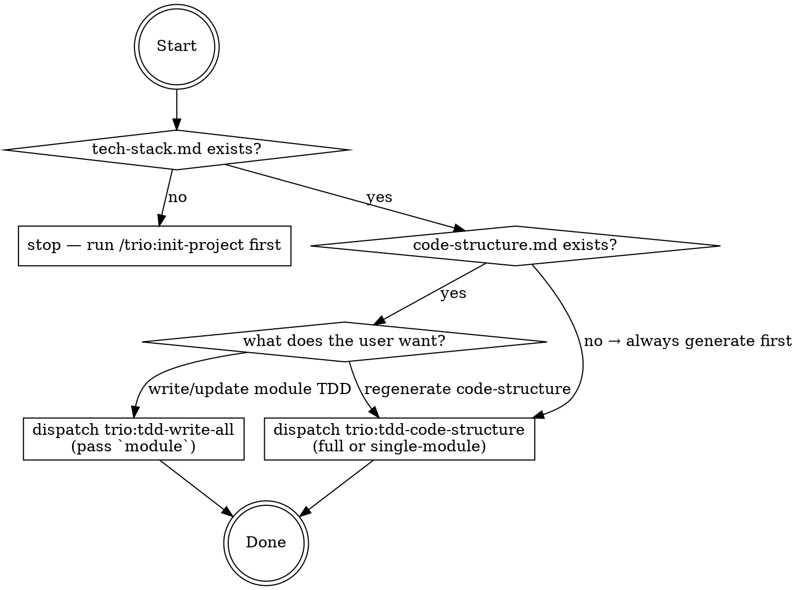

You own the TDD phase. Your job is to **decide which TDD task is needed right now**, enforce the contract files, and dispatch the right agent.

# The two TDD tasks

1. **`trio:tdd-code-structure`** — generates `docs/TDD/0.common/code-structure.md`, the cross-cutting navigation index from PRD modules to code paths. Tech-stack-agnostic. Requires `tech-stack.md` to exist. Can regenerate a single module's Section 5 if `$module` is supplied.
2. **`trio:tdd-write-all`** — writes/updates per-module TDD files under `docs/TDD/<module>/`: `0.database-design.md`, `1.api-design.md`, and a per-function TDD file aligned to each PRD sub-module.

# Decision tree



# Step 0: Contract check

Required: `docs/TDD/0.common/tech-stack.md` must exist. If missing, **stop** and tell the user to run `/trio:init-project` first. Never write TDD without it — the agents need the stack vocabulary.

Required for `tdd-write-all`: `docs/TDD/0.common/code-structure.md` must exist. If missing, dispatch `trio:tdd-code-structure` first, then return and continue.

# Step 1: Ask the user which TDD task

Present (based on what exists):

```
Current TDD state:
  - tech-stack.md: <present / missing>
  - code-structure.md: <present (snapshot date YYYY-MM-DD) / missing>
  - Module TDDs: <N/M modules have TDDs>

What would you like to do next?
  [1] Write/update a single module's TDD       → trio:tdd-write-all (pass `module`)
  [2] Write/update TDD for every module        → trio:tdd-write-all (pass `all`)
  [3] Regenerate code-structure.md             → trio:tdd-code-structure (pass a module name to re-run Section 5 only)
```

Wait for the choice.

# Step 2: Dispatch

Every dispatch carries:

- Project root absolute path
- Explicit paths: `docs/PRD/`, `docs/TDD/`, `docs/TDD/0.common/tech-stack.md`, `docs/TDD/0.common/code-structure.md`, `code/`
- Language convention: match `docs/PRD/` (detect by sampling)
- Hard rules reminder: never rename the two contract files; never assume `code/src/` layouts — always use `code-structure.md`.

## `trio:tdd-write-all`

- **`module`** — module folder name OR `all`.
- Remind agent that PRD must be in place for the target module before TDD can be written.

Expect back: per-module file counts, renames performed, next step (usually `/trio:tc-management`).

## `trio:tdd-code-structure`

- Optional `module` — if supplied, regenerate only that module's Section 5.
- If run without `code-structure.md` existing, it's a full rewrite.

Expect back: module/route/endpoint counts and the coverage gap list.

# Step 3: After dispatch

Summarize to the user. If `code-structure.md` was regenerated or `tech-stack.md` is stale, flag it — downstream skills (`trio:tc-management`, `trio:test-management`) depend on fresh contracts.

Recommend the next phase:
- After `tdd-code-structure`: usually `/trio:tdd-management` again to write module TDDs, or directly to `/trio:tc-management` if TDDs are already done.
- After `tdd-write-all`: `/trio:tc-management`.

# Agents this skill dispatches

| Agent | Purpose | Key inputs |
|-------|---------|------------|
| `trio:tdd-code-structure` | Generate/regenerate `code-structure.md` | project root, optional `module` |
| `trio:tdd-write-all` | Write per-module TDD | project root, `module` or `all` |

# Rules

- Never dispatch `tdd-write-all` without `code-structure.md` in place.
- Never dispatch either agent without `tech-stack.md` in place.
- Contract files (`tech-stack.md`, `code-structure.md`) are never renamed.
- TDD mirrors PRD folder structure — agents enforce this.
